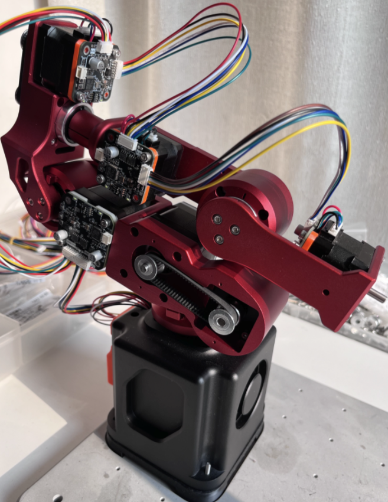
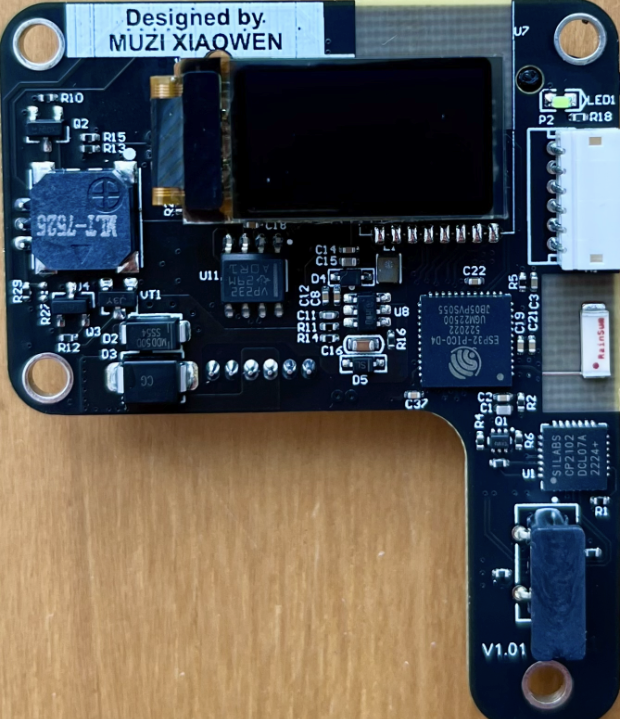
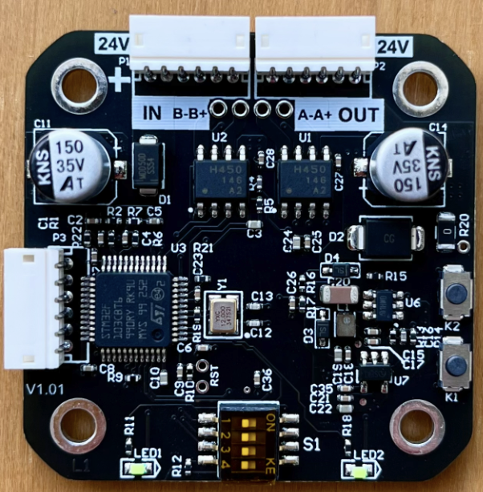
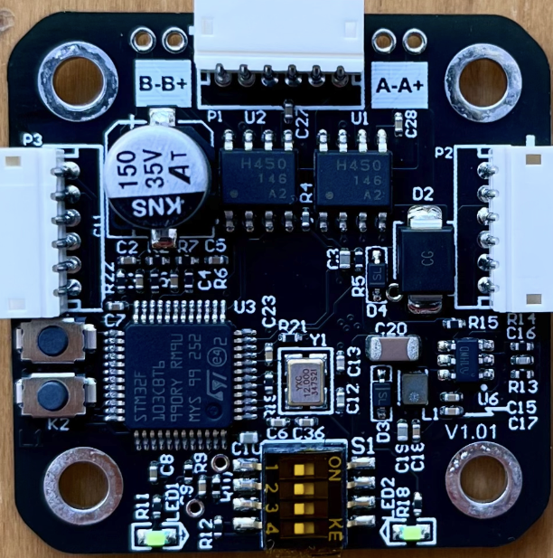

# Dummy
稚晖君dummy复制，目标是全国产谐波减速器，价格在3000元之内！

1. 目录描述
- Firmware 包括ref控制板，42，35驱动板所用源代码
- Hardware 重新设计包括ref控制板，42，35驱动板schematic, pcb所有文件
- 3d-model 所有复制dummy 3d打印文件
- ESP32-iot esp32 supports files

1. 重新设计的ref控制板

- 简化设计，更适合量产
1. 修改所有1.0mm的连接器为插针1.5mm，fix原版连接器容易脱落
1. 删除base板，将base板子集成到了主板上
1. 添加switching ldo，供电电流最大2A，fix原版mcu ldo电流过小，温度过高issue
1. 将led ring，buzzer 控制从ESP32 改到stm32 mcu
1. 更合理的布局
1. 降低量产成本

1. 重新设计的42/35驱动板

- 42/35驱动板正式版
1. 所有连接器改为1.5mm 3A 座子，更适合量产
1. 电源线复用两根1007/26号线，最大支持到3A
1. CAN BUS ID 通过板载拨码开关设置
